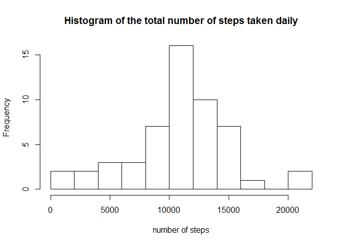
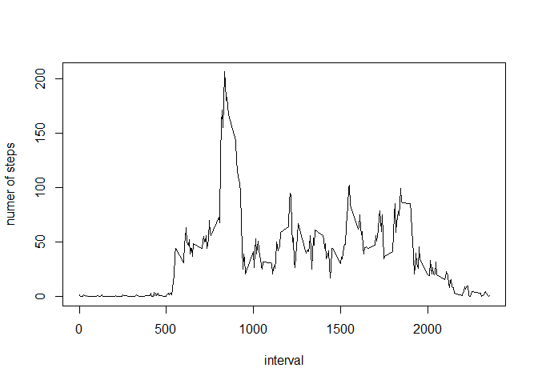
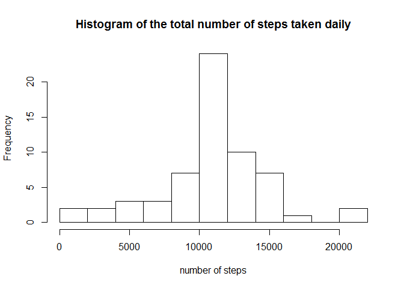
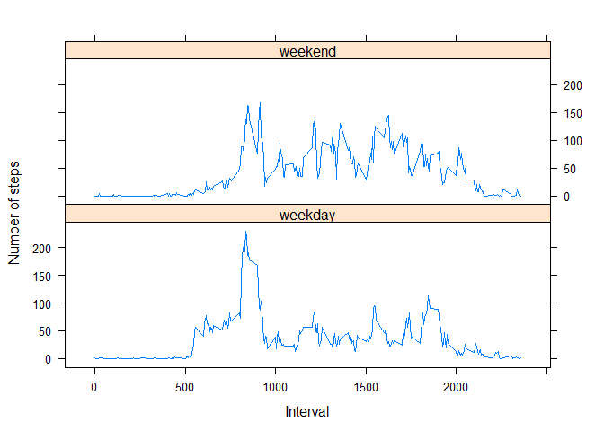

# Reproducible Research: Peer Assessment 1
Tuong Nguyen  
March 18, 2017  


## Loading and preprocessing the data

```r
rawdata <- read.csv('activity.csv', colClasses = c('integer','character','integer')) %>% data.table()
print(head(rawdata),row.names = FALSE)
```

```
##  steps       date interval
##     NA 2012-10-01        0
##     NA 2012-10-01        5
##     NA 2012-10-01       10
##     NA 2012-10-01       15
##     NA 2012-10-01       20
##     NA 2012-10-01       25
```


## What is mean total number of steps taken per day?
For this part of the assignment, ignore the missing values in the dataset.

1. Calculate the total number of steps taken per day

```r
daily <- rawdata[!is.na(rawdata$steps)][,.(steps = sum(steps)),by=date]
print(head(daily),row.names = FALSE)
```

```
##        date steps
##  2012-10-02   126
##  2012-10-03 11352
##  2012-10-04 12116
##  2012-10-05 13294
##  2012-10-06 15420
##  2012-10-07 11015
```

2. Make a histogram of the total number of steps taken each day

```r
hist(daily$steps,breaks = 10, xlab = 'number of steps',
     main = "Histogram of the total number of steps taken daily")
```

<!-- -->

3. Calculate and report the mean and median of the total number of steps taken per day

```r
dailymean   <- as.character(round(mean(daily$steps),0))
dailymedian <- as.character(median(daily$steps))
```
Mean of the total of steps taken per day is 10766 (steps)  
Median of the total of steps taken per day is 10765 (steps)


## What is the average daily activity pattern?

1. Make a time series plot (i.e. type = "l") of the 5-minute interval (x-axis) and the average number of steps taken, averaged across all days (y-axis)

```r
timeseries <- rawdata[!is.na(rawdata$steps)][,.(steps = round(mean(steps),0)),by=interval] 
plot(x = timeseries$interval, y = timeseries$steps, type = 'l',xlab = 'interval', ylab = 'numer of steps')
```

<!-- -->

2. Which 5-minute interval, on average across all the days in the dataset, contains the maximum number of steps?

```r
maxinterval <- timeseries[which(timeseries$steps == max(timeseries$steps)),]
print(maxinterval,row.names=FALSE)
```

```
##  interval steps
##       835   206
```


## Imputing missing values

Note that there are a number of days/intervals where there are missing values (coded as NA). The presence of missing days may introduce bias into some calculations or summaries of the data.

1. Calculate and report the total number of missing values in the dataset (i.e. the total number of rows with NAs)

```r
missinginterval <- rawdata[which(is.na(rawdata$steps)),]
numberofmissingvalue <- nrow(missinginterval)
```
Total number of missing values in the dataset is 2304 (intervals)  

2. Devise a strategy for filling in all of the missing values in the dataset. 
Stratgey: missing data is replaced by mean for that 5-minute interval


```r
interval<- rawdata[!is.na(rawdata$steps)][,.(average_steps = round(mean(steps),0)),by=interval] 
print(head(interval),row.names = FALSE)
```

```
##  interval average_steps
##         0             2
##         5             0
##        10             0
##        15             0
##        20             0
##        25             2
```

3. Create a new dataset that is equal to the original dataset but with the missing data filled in.

```r
df <- merge(x=rawdata,y=interval,by='interval') %>%
  mutate(steps = ifelse(is.na(steps),average_steps,steps)) %>%
  select(date,interval,steps) %>% arrange(date,interval)
print(head(df),row.names=FALSE)
```

```
##        date interval steps
##  2012-10-01        0     2
##  2012-10-01        5     0
##  2012-10-01       10     0
##  2012-10-01       15     0
##  2012-10-01       20     0
##  2012-10-01       25     2
```

4. Make a histogram of the total number of steps taken each day and Calculate and report the mean and median total number of steps taken per day. Do these values differ from the estimates from the first part of the assignment? What is the impact of imputing missing data on the estimates of the total daily number of steps?


```r
daily <- df[,.(steps = sum(steps)), by = date]
hist(daily$steps,breaks = 10, xlab = 'number of steps',
     main = "Histogram of the total number of steps taken daily")
```

<!-- -->

```r
dailymean   <- as.character(round(mean(daily$steps),0))
dailymedian <- as.character(median(daily$steps))
```

Mean of the total of steps taken per day is 10766 (steps)  and is the same as the first part of the assignment.
Median of the total of steps taken per day is 10762 (steps) is 3 steps lesss than the first part of the assignment.


## Are there differences in activity patterns between weekdays and weekends?

For this part the weekdays() function may be of some help here. Use the dataset with the filled-in missing values for this part.

1. Create a new factor variable in the dataset with two levels - "weekday" and "weekend" indicating whether a given date is a weekday or weekend day.

```r
df1 <-  mutate(df,dayofweek = weekdays(as.Date(date),abbreviate = TRUE)) %>%
  mutate(dayofweek = ifelse(dayofweek=='Sat' | dayofweek=='Sun','weekend','weekday')) %>%
  mutate(dayofweek = as.factor(dayofweek)) %>% arrange(date,interval)
print(head(df1),row.names=FALSE)
```

```
##        date interval steps dayofweek
##  2012-10-01        0     2   weekday
##  2012-10-01        5     0   weekday
##  2012-10-01       10     0   weekday
##  2012-10-01       15     0   weekday
##  2012-10-01       20     0   weekday
##  2012-10-01       25     2   weekday
```

2. Make a panel plot containing a time series plot (i.e. type = "l") of the 5-minute interval (x-axis) and the average number of steps taken, averaged across all weekday days or weekend days (y-axis). See the README file in the GitHub repository to see an example of what this plot should look like using simulated data.

```r
df2 <- df1[,.(steps = round(mean(steps),0)),by =.(dayofweek,interval) ]
xyplot(steps~interval|dayofweek, df2, layout=c(1,2), type='l', ylab='Number of steps', xlab='Interval')
```

<!-- -->

```r
print(head(df2),row.names=FALSE)
```

```
##  dayofweek interval steps
##    weekday        0     2
##    weekday        5     0
##    weekday       10     0
##    weekday       15     0
##    weekday       20     0
##    weekday       25     2
```


